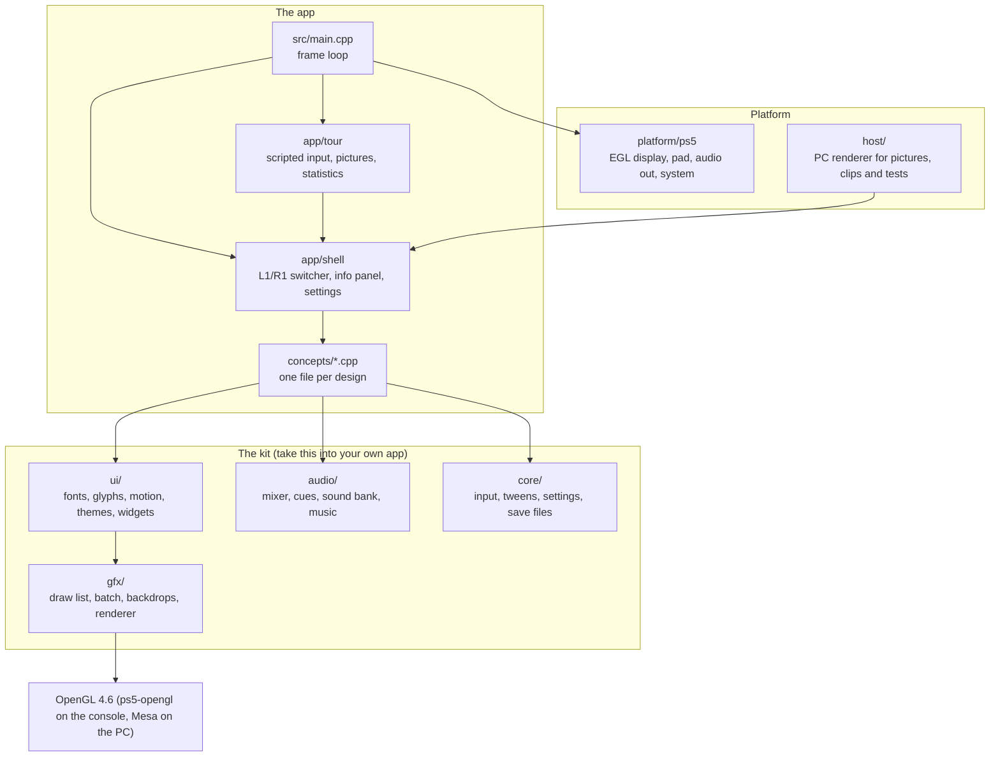
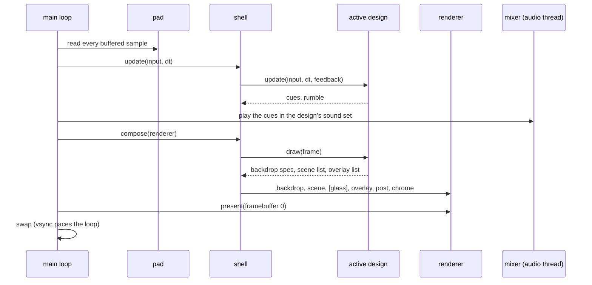

# Architecture

The whole kit (renderer, motion, widgets, sound, input) is about eight
thousand lines of plain C++ that you can read in an afternoon.
It is immediate mode: every frame, a screen computes rectangles and records
shapes; one OpenGL program draws them. There is no widget tree, no layout
engine and no scripting layer.

## Layers



Nothing above the platform layer knows which machine it runs on. The same
shell, designs and tour run on the console and, through `host/`, on a PC with
Mesa's software renderer. That is what makes fast iteration, unit tests and
the generated documentation possible.

## One frame



- **Update** owns all state and all animation: springs advance by `dt`,
  which is measured frame start to frame start and clamped so a hitch cannot
  teleport anything.
- **Draw** is pure. A design reads its state and fills a `Frame`. The shell
  may call it more than once per frame (both designs are drawn during a
  switch).
- **Present** uploads the frame's instances once and issues one instanced
  draw per *run*: a stretch of shapes that share a clip rectangle and a
  texture. A typical screen is 2 to 15 draw calls.

## Rendering

| Piece | What it does |
| --- | --- |
| `gfx::DrawList` | Records instances (96 bytes each: rectangle, two colours, border colour, parameters) and applies clip, transform and opacity on the CPU as they are recorded |
| `gfx::GlBatch` | One vertex and fragment shader pair draws every instance as a quad; the fragment shader evaluates a signed distance function per shape, so edges are anti-aliased at any scale without multisampling |
| `gfx::Font` | Signed-distance-field atlases baked offline (`tools/bake-fonts.sh`), one single-channel texture per face, bound to fixed texture units so text never breaks a run |
| `gfx::Backdrop` | One full-screen triangle and a fragment shader with a mode switch: ten procedural backgrounds and two post overlays |
| `gfx::Renderer` | Plays a frame's layers in order and, on request, replays the layers so far into a 480 x 270 target, blurs it in four passes and exposes it as the glass texture |
| `gfx::Canvas` | An off-screen render target (the sample covers are rendered through one at start-up) |

Everything on screen, in every design and every theme, goes through these
classes and therefore through OpenGL. There is no second renderer, no CPU
rasteriser and no system UI in the picture.

## Sound

The mixer runs on its own thread (48 kHz, stereo, 32 voices, three buses, a
soft limiter). The game thread posts commands through a lock-free queue;
posting never blocks or allocates. Music is decoded on the main thread into a
ring buffer about 0.7 seconds ahead. See [SOUND.md](SOUND.md).

## Input

`platform/ps5/pad` reads every sample the controller buffered since the last
frame. `core/input` folds them into one `InputFrame`: press edges are
accumulated across samples (a tap shorter than a frame still registers),
directions repeat while held, sticks get a radial dead zone, and a controller
that disconnects or is taken by the system overlay releases everything.

## Files

```
src/
  main.cpp            console entry point and frame loop
  app/                shell, tour, the Concept interface
  concepts/           the designs, one file each, and their registry
  ui/                 fonts, glyphs, motion helpers, themes, widgets, pixel font, confetti
  ui/components/      the component library (lists, grids, dialogs, forms, indicators)
  gfx/                draw list, GL batch, fonts, backdrops, renderer, canvas
  audio/              mixer, cues and sound bank, music player, WAV decoder
  core/               input, tweens and springs, settings, save files, frame statistics
  demo/               invented sample content and its cover art
  platform/ps5/       EGL display, controller, audio output, system services
  runtime/            process heap and libc shims the OpenGL runtime needs
  third_party/stb/    stb_vorbis (music decoding)
host/                 PC renderer: pictures, clips, manifest
tests/unit/           GoogleTest suite (no OpenGL needed)
tools/                build, deploy, snapshots, media, fonts, audio checks
tooling/, runtime/    the native PS5 toolchain glue (from ps5-native-app-boilerplate)
assets/               baked fonts, sound effects by set, music
docs/                 the guides; docs/media is generated; docs/platform is the build reference
```
